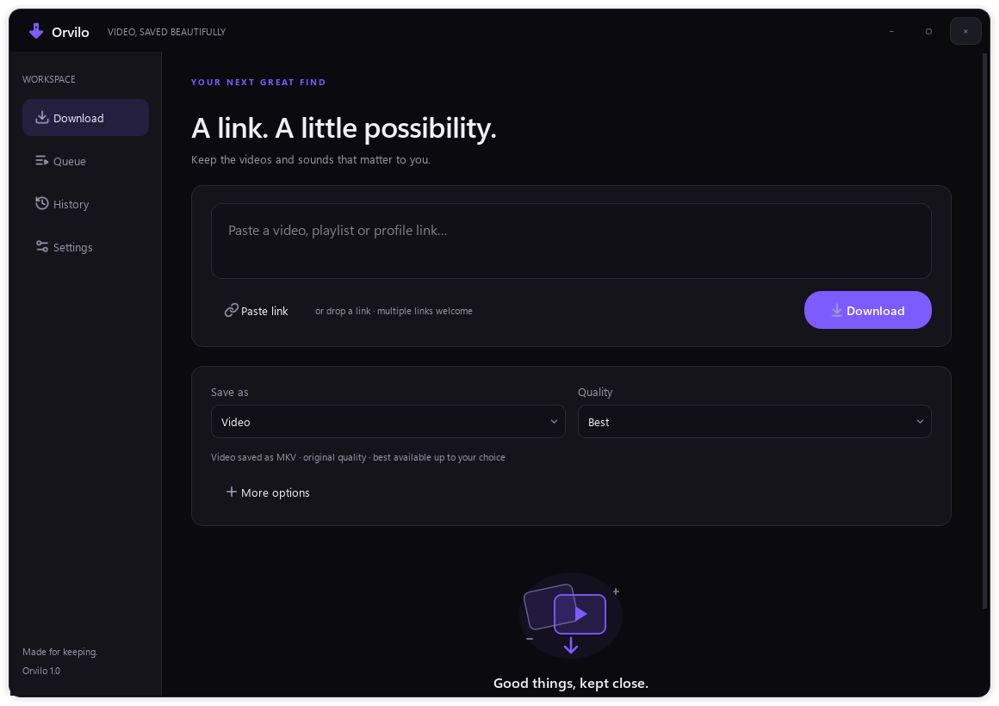

  

<h1 align="center">Orvilo</h1>

  <strong>Video, saved beautifully.</strong> 
  A quiet place for the videos and sounds you want to keep.

  <a href="https://github.com/aadiichau/orvilo/releases/latest"><strong>Download for Windows →</strong></a>
  &nbsp; · &nbsp;
  <a href="docs/GUIDE.md">Quick guide</a>
  &nbsp; · &nbsp;
  <a href="docs/DEVELOPMENT.md">Build from source</a>

  Windows 10 / 11 · 64-bit · No account · No telemetry

  <picture>
    <source media="(prefers-color-scheme: dark)" srcset="docs/images/download-dark.png">
    <source media="(prefers-color-scheme: light)" srcset="docs/images/download-light.png">
    
  </picture>

## A link. A little possibility.

Paste a video, playlist, or profile link. Pick your quality. Save it to your
computer. Orvilo brings the reach of [yt-dlp](https://github.com/yt-dlp/yt-dlp)
into a focused Windows app, with the tools you need and room to breathe.

<table>
  <tr>
    <td width="50%" valign="top">
      <h3>Picture or sound</h3>
      
Keep the best available video up to 4K, or save MP3, M4A, FLAC, WAV, or Opus. Choose a clip, add subtitles, and keep the artwork.

    </td>
    <td width="50%" valign="top">
      <h3>A queue that keeps up</h3>
      
Batch links, select playlist items, and run up to six downloads at once. Follow progress, pause transfers, and retry interruptions.

    </td>
  </tr>
  <tr>
    <td valign="top">
      <h3>Your own library</h3>
      
Search your history, filter by site or date, reveal a file, or download it again. Missing files are marked clearly.

    </td>
    <td valign="top">
      <h3>Made to feel at home</h3>
      
Dark and light themes, your accent color, a resizable window, a system tray, and a download folder you control.

    </td>
  </tr>
</table>

## Start in three steps

1. Open the [latest release](https://github.com/aadiichau/orvilo/releases/latest)
   and download **Orvilo-Setup-1.0.2.exe**. Prefer no installation? Choose
   **Orvilo-1.0.2-Windows-x64.exe**.
2. Run the installer and open Orvilo. Choose **Install FFmpeg** when prompted
   for the one-time video-tools download. Python is included; no terminal or
   manual dependency setup is needed.
3. Paste a link, choose **Video** or **Audio only**, and select **Download**.

The Windows builds are currently unsigned. Checksums accompany the release.
The portable app takes a few seconds to unpack its bundled runtime on launch.
Video tools are downloaded directly from their publisher and checked before use.

> Download only content you own or have permission to save.

## Many sites. One familiar flow.

YouTube · Bilibili · X · TikTok · Instagram · RedNote / Xiaohongshu · Facebook ·
Reddit · Twitch · Vimeo · and more through yt-dlp.

Availability depends on the site, the URL, your region, and whether your browser
session has access. No downloader can promise that every link will work forever.
Orvilo includes a one-click engine update and a generic extractor fallback.
Kuaishou currently uses that fallback; it has no dedicated extractor in the
bundled engine. DRM-protected services are outside Orvilo's scope.

**Already signed in?** Choose Chrome, Edge, or Firefox cookies in Settings.
Browser protection can prevent Chrome/Edge cookie access; a Firefox session or
Netscape cookies file is an alternative. Orvilo does not bypass access controls.

## Small details, already considered

- Drag links into the window, paste many at once, or enable clipboard link detection.
- Save subtitles as SRT or embed them in video, along with metadata and artwork.
- Organize files by site, customize names, set a speed limit, and use a proxy.
- Resume supported partial downloads; unfinished jobs return paused after restart.
- Keep settings, history, and thumbnails locally. No Orvilo service receives them.

Video is saved as **MKV** to preserve source codecs and support embedded subtitles.
Quality choices are a maximum resolution, not an upscaling request. Clips and
FFmpeg processing have different pause, cancellation, and speed-limit behavior;
the [quick guide](docs/GUIDE.md#transfer-and-format-details) explains those limits.

## New in 1.0.2

Bilibili downloads recover more reliably from interrupted transfers. Orvilo now
keeps the backup servers supplied by Bilibili and resumes the same stream there
when its primary server fails. Existing partial files can be kept and retried.

[Read the release notes →](docs/RELEASE_NOTES_1.0.2.md)

## Open source, locally run

Built with **Python · PySide6 · yt-dlp · FFmpeg · SQLite**.
The [development guide](docs/DEVELOPMENT.md) covers one-command setup, packaging,
tests, custom site extractors, and themes. The download implementation was
checked with 51 automated tests, packaged runtime checks, and a live Bilibili
regression; see [validation notes](docs/RELEASE_NOTES_1.0.2.md#validation).

Need help? Start with [troubleshooting](docs/GUIDE.md#troubleshooting), then
[open an issue](https://github.com/aadiichau/orvilo/issues). Include the app version
and the message shown, but never post cookies, passwords, or private media links.

Orvilo's original code is [MIT licensed](LICENSE). The bundled Windows app is
distributed under GPL-3.0-or-later; dependencies retain their own licenses.
See [third-party notices](assets/THIRD_PARTY_NOTICES.md) and
[dependency source and rebuild information](DEPENDENCY_SOURCES.md).

Made for keeping.

